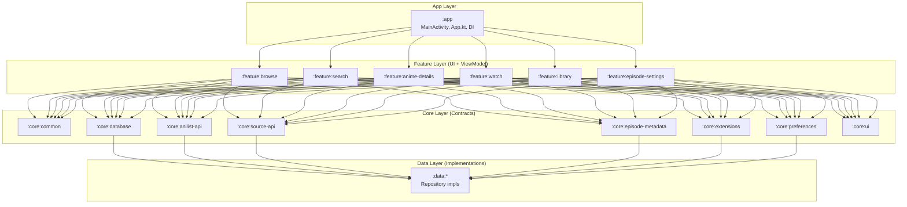

# ANIKUTA — Architecture Overview

> **Source of truth**: `ARCHITECTURE.md` at project root. This file is a reverse-engineered summary for persistent memory.

## Executive Summary

**ANIKUTA** is an anime-first Android app (manga deferred but architecture-ready) that reimagines Aniyomi — it is explicitly **NOT a fork**. The Aniyomi source is kept as a read-only reference snapshot at `ANIYOMI_REFRENCE/`. All new code lives in `ANIKUTA_PROJECT/ANIKUTA/`.

The project is currently at **Phase 7+ (Implementation IN PROGRESS)**. The app builds, ships debug APKs via CI, and has working: browse, search, anime details, watch (MPV), library, extensions, and the episode-settings subsystem.

---

## Tech Stack

| Layer | Technology |
|-------|-----------|
| Language | Kotlin |
| UI | Jetpack Compose (Compose-first) |
| DI | Koin + Injekt (Aniyomi-compat for extensions) |
| Database | SQLDelight |
| Video Playback | MPV (via `aniyomi-mpv-lib`) |
| Architecture | Multi-module Gradle, convention plugins |
| Build | Gradle Kotlin DSL, `buildSrc/` convention plugins |
| CI | GitHub Actions (CI-only builds — ADR-003, no local APK builds) |
| Min SDK | Per `ARCHITECTURE.md` (check `build.gradle.kts` for exact version) |

**Application ID**: `app.confused.anikuta`
**Version**: 0.1.0 (versionCode 1)
**Package convention**: `app.confused.anikuta.*`

---

## Module Architecture

The project uses a **multi-module Gradle architecture** with 4 module groups plus `buildSrc` and `i18n`:

### `:app` — Application Module
- `App.kt` — Application class (Koin + Injekt DI setup, crash handler, extension init)
- `MainActivity.kt` — Single Activity, Compose host, **hand-rolled state-machine navigation** (NOT Voyager, NOT Compose Nav — state flags like `detailAnimeId`, `showSettings`, `episodeSettingsPage` drive a `when` block)
- `di/` — Koin modules (DatabaseModule, ExtensionModule, RepositoryModule, SearchModule)
- `error/` — Crash handler + ErrorActivity

### `:core:*` — 14 Core Modules (interfaces, contracts, shared logic)

| Module | Purpose |
|--------|---------|
| `core:common` | Domain models, shared utilities |
| `core:database` | SQLDelight database setup |
| `core:anilist-api` | AniList GraphQL API client |
| `core:source-api` | Extension source contract (Aniyomi-compatible) |
| `core:episode-metadata` | Episode metadata enrichment (Jikan/MAL + Anikage.cc + AniList Streaming) |
| `core:extensions` | Extension loading system (Injekt-based) |
| `core:preferences` | Preference storage |
| `core:ui` | Shared Compose UI components, theme |
| `core:util` | Utility functions |
| *(+ others)* | See `ARCHITECTURE.md` for full list |

### `:feature:*` — Feature Modules (UI + ViewModel per feature)

| Module | Purpose |
|--------|---------|
| `feature:browse` | Browse/discovery screen |
| `feature:search` | Search (dual-source AniList + extensions, manual link flow) |
| `feature:anime-details` | Anime details (3-stage load: AniList → source match → episodes + metadata) |
| `feature:watch` | Watch screen + MPV player (YouTube-style, gestures, PiP, episode switching) |
| `feature:library` | Library (grid/list, categories, selection mode) |
| `feature:episode-settings` | Episode settings subsystem (4 full-page screens: Hub → Display / Layout / Metadata) |

### `:data:*` — Data Modules (Repository implementations)
- Repository implementations backing the `:core` interfaces.

### `buildSrc/` — Convention Plugins
- `anikuta.library` — Standard library module convention
- `anikuta.library.compose` — Compose-enabled library module convention

---

## Data Flow (Critical Rule)

Data flows strictly through layers — **never skip a layer**:

```
UI → ViewModel → Repository → Data Source
```

- **UI**: Display logic + event forwarding only
- **ViewModel**: Never calls APIs/databases directly — only Repositories
- **Repository**: Interfaces live in `:core`; implementations in `:data`
- **Data Source**: AniList API, extensions, SQLDelight, etc.

**Module boundary rule**: Feature modules **never** import from other feature modules. Cross-feature communication goes through `:core`.

---

## Architecture Diagram (Mermaid)



---

## Key Architecture Decisions (ADRs)

30+ ADRs recorded in `DOCS/04-design-decisions.md`. Key ones:

| ADR | Decision |
|-----|---------|
| ADR-003 | CI-only builds (no local APK builds) |
| ADR-008 | ntfy.sh notifications on every task completion |
| ADR-010 | AniList as co-primary data source (not just a tracker) |
| ADR-015 | Custom M3-inspired design language (not stock Material 3) |
| ADR-029 | Aniyomi-compatible extension system |

---

## Current Phase Status

**Phase 7+ (Implementation) — IN PROGRESS**

### Completed
- ✅ Repo structured: `ANIYOMI_REFRENCE/` (reference + 68-doc analysis), `OLD_ANIKUTA/` (prior attempt + screen analysis), `ANIKUTA_PROJECT/` (live code)
- ✅ Rules established (`RULES/ai-agent-rules.md` — 14 sections)
- ✅ Aniyomi reference fully documented (`ANIYOMI_REFRENCE/DOCUMENTATION/`)
- ✅ Vision clarified → 30+ ADRs in `DOCS/04`
- ✅ Design language docs complete (`DESIGN_LANGUAGE/` — 12 principles, 9 components, themes, 10 per-screen specs)
- ✅ Old ANIKUTA key screens analyzed (`OLD_ANIKUTA/ANALYSIS/` — 4 files)
- ✅ `ARCHITECTURE.md` finalized — the single source of truth
- ✅ Gradle project scaffolded under `ANIKUTA_PROJECT/ANIKUTA/` — multi-module
- ✅ Browse + AniList API + extension system (Aniyomi-compat via Injekt)
- ✅ Search (dual-source AniList + extensions, manual link flow)
- ✅ Anime details (3-stage load: AniList → source match → episodes + metadata)
- ✅ Watch screen + MPV player (YouTube-style, gestures, PiP, episode switching)
- ✅ Library (grid/list, categories, selection mode)
- ✅ Episode metadata enrichment (Jikan/MAL + Anikage.cc + AniList Streaming)
- ✅ Episode settings subsystem (`:feature:episode-settings` — 4 full-page screens with sticky live previews)

### Not Done Yet
- ❌ Trackers (AniList/MAL tracking sync beyond display)
- ❌ Manga reader (anime-first; manga comes later)
- ❌ Downloads / offline playback
- ❌ Notifications (dual-mode episode notifications)
- ❌ Backups
- ❌ Release (Play Store / signed APK) build flavor

---

## Navigation Pattern (Important)

The app uses a **hand-rolled state-machine for navigation** in `MainActivity.kt` — NOT Voyager, NOT Compose Nav. State flags like `detailAnimeId`, `showSettings`, `episodeSettingsPage` drive a `when` block. New screens must follow this pattern.